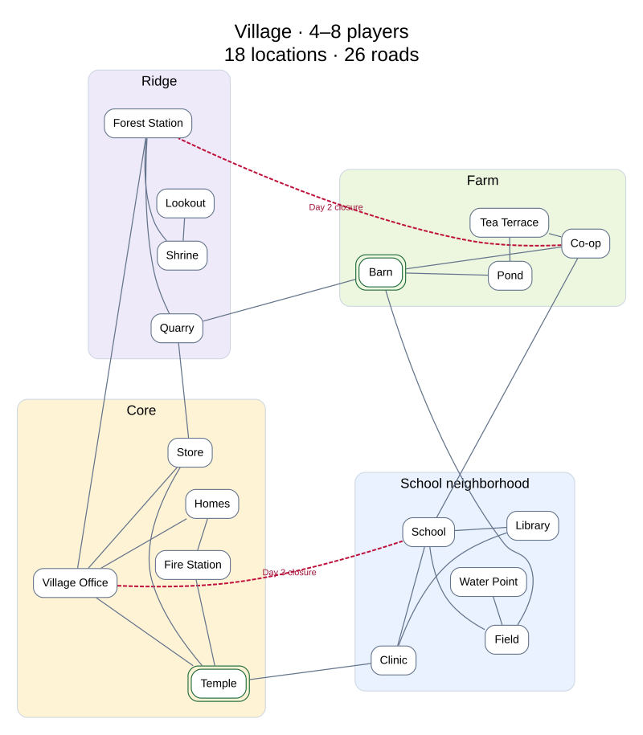
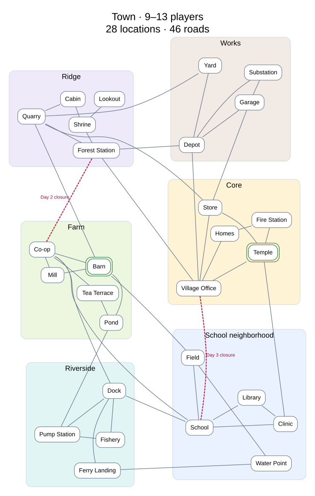
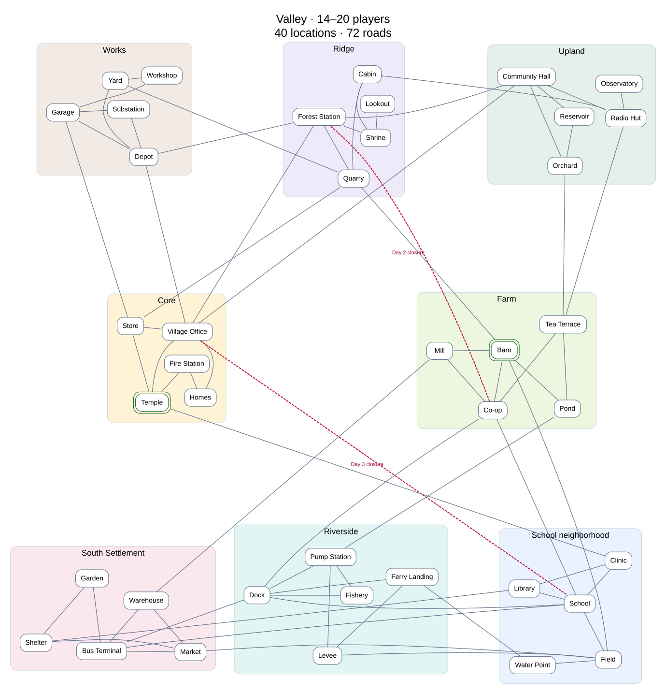

# BLACKOUT rules v0.0.2

Status: Draft — not implemented or active

Players: 4–20, using three map scales

Base rules: [v0.0.1](v0.0.1.md)

This is the proposed four-plus-player rule set. **All v0.0.1 rules apply except the explicit changes below.** That includes the seven-day sequence, two actions per day, inventory capacities, scavenging and exchange, starvation calculation, communication prices and payload caps, readiness/privacy rules, and scoring structure. Changes below replace the corresponding baseline rules; they do not make v0.0.2 the running version.

Map populations, routes, cache weights, facilities and spawn pools are versioned in [maps-v0.0.2.json](maps-v0.0.2.json). This document and that data describe a draft scenario, not production configuration. Design decisions, outstanding questions, rollout and validation work live in the linked issues in the [rules index](README.md).

## Three authored scales

| | Village | Town | Valley |
| --- | --- | --- | --- |
| Players | 4–8 | 9–13 | 14–20 |
| Playable locations | 18 | 28 | 40 |
| Roads / paths | 26 | 46 | 72 |
| Neighborhoods | 4 | 6 | 8 |
| Enclosed locations | 7 | 10 | 13 |
| Bulletin boards | 4 | 6 | 8 |
| Landline endpoints | 4 | 5 | 6 |
| Observation locations | 1 | 2 | 3 |
| Longest shortest route, intact | 6 moves | 6 moves | 6 moves |
| Longest shortest route, both closures | 6 moves | 7 moves | 8 moves |
| Worst route to either evacuation site after closures | 4 moves | 4 moves | 4 moves |
| Cached food, by actual attendance | 24–48 | 54–78 | 84–120 |
| Cached batteries, by actual attendance | 12–24 | 27–39 | 42–60 |

Graph counts and travel bounds are measured from the accompanying prototypes. Facilities and supplies are proposed settings, not implemented rules. Each road costs one ordinary movement action. Crossings are edges, replacing the old two-node zero-cost bridge representation. A node represents a place where players can act, not a bend in the road.

Larger maps grow in breadth and route choice while keeping intact maximum travel bounded. Seven days cannot accommodate walking distances proportional to population. At each band's minimum, exploration is more dispersed; at its maximum, coordination and cache competition are denser. Both ends need trials.

## Village: a compact river settlement

Four neighborhoods establish the survival choices. A west-bank civic center and hillside face a school neighborhood and farms across the river. Local streets form small loops; the lookout and water point are side trips. Alternative crossings offer different services along the way.

| Neighborhood | Locations | Function |
| --- | --- | --- |
| Core | Village Office, Temple, Store, Homes, Fire Station | Food, information, enclosed meeting places |
| School | School, Clinic, Field, Library, Water Point | Community services and shelter access |
| Farm | Co-op, Tea Terrace, Pond, Barn | Battery concentration, scattered food, southern crossing |
| Ridge | Forest Station, Shrine, Quarry, Lookout | Observation, exposed approaches, limited local supplies |

Every named box is a playable location; shaded boundaries group neighborhoods. Every line is one bidirectional, one-move road. Red dashed roads close on the labeled day. Double green outlines mark the two possible evacuation sites. Light gaps separate roads at crossings: only named location boxes are junctions. These gaps do not add a bridge rule or an extra move. Layout is schematic: line length and compass direction do not encode travel distance or terrain.

[Open the full-size village diagram](diagrams/v0.0.2/village.svg).

After the main bridge closes, Office → Temple → Clinic → School takes three moves instead of one. Two players can repair the shortcut, or take the detour and collect supplies along the way. The route remains usable without a special ability or instructor ruling.

## Town: multiple service centers

Retain the recognizable core and add two neighborhoods. Add a Mill to Farm and a Cabin to Ridge. These expand the same town, with different street patterns and functions.

| Addition | Locations | Connections and decisions |
| --- | --- | --- |
| Riverside | Dock, Fishery, Pump Station, Ferry Landing | Connects School and Farm; Fishery food, Pump batteries; Ferry connects to Water Point |
| Works | Depot, Garage, Substation, Yard | Connects Core and Ridge; concentrated batteries; multiple service roads |
| Farm | Mill | Co-op–Mill–Barn local loop |
| Ridge | Cabin | Shrine–Cabin–Quarry alternative |

Complete Town map: all 28 locations and 46 roads, grouped into six neighborhoods. The Village legend above applies.

[Open the full-size town diagram](diagrams/v0.0.2/town.svg).

Players can organize food collection through Riverside while others collect batteries in Works. Service centers distribute traffic; no neighborhood is intended to be self-sufficient. The original crossings still matter, even with more local loops.

## Valley: connected settlements

Add Upland and South Settlement, each with multiple approaches. Expand Riverside with a Levee and Works with a Workshop. All eight neighborhoods now have five locations, but their internal street patterns differ.

| Addition | Locations | Connections and decisions |
| --- | --- | --- |
| Upland | Community Hall, Reservoir, Orchard, Radio Hut, Observatory | Connects Core, Ridge and Farm; food, batteries, observation spur |
| South Settlement | Bus Terminal, Warehouse, Market, Garden, Shelter | Connects School, Riverside and Farm; logistics, food, enclosed destinations |
| Riverside | Levee | Pump–Levee–Ferry loop and an evacuation path to Field |
| Works | Workshop | Garage–Workshop–Yard service loop |

[Open the full-size valley diagram](diagrams/v0.0.2/valley.svg).

Players have more destinations and contacts to coordinate, rather than merely a longer walk around the perimeter. Keep a whole-map overview with neighborhood focus for readability. Do not reveal current player locations to make the overview useful.

## Geography and movement

Use the river to explain scarce crossings and contours to explain hillside paths. Streets should follow these features, with irregular local blocks. Crossing lines without a marked location are not junctions: the artwork must clearly show bridges or separation. The graph is a topology proposal, not finished cartography; terrain placement still needs review against the exact edges.

Every neighborhood has multiple external connections. Most locations have two or three exits, with some higher-degree service hubs. Avoid a universal central hub and a uniform grid. Keep useful dead ends: Lookout on every map, Observatory in Valley, Water Point in Village. Their value must come from information or services, not decorative travel.

For this prototype every road costs one move. Main roads, footbridges and trails do not yet introduce terrain costs. Preserve the Reservist's existing two-cost movement ability. Names such as Reservoir, Water Point and Radio Hut do not add water, electricity or free communication subsystems; explicit caches and facilities determine their effects.

## Disasters create detours, not mandatory repairs

Retain event timing, bound to each map's authored edges:

- Day 2 closes Forest Station–Co-op, the upper road.
- Day 3 closes Village Office–School, the main bridge.
- Temple–Clinic footbridge and Quarry–Barn causeway remain usable.

All three graphs remain connected with both closures. Each blocked one-move edge has a three-move replacement route even while the other remains closed. Repair restores convenience. Keep the existing two-player repair requirement and action costs.

Do not add closures automatically with population. Group size determines map scale; a future difficulty setting can determine disruption severity. An isolation scenario would need separate supply and rescue validation.

## One shared evacuation destination

The public fallback remains School. On Night 4, the server changes the official destination to **Temple or Barn**, disclosed by radio and the Village Office bulletin under the existing information rules. There is no occupancy limit.

Both sites are at most four ordinary movement actions from every location on every map, even with both roads closed. Night 4 leaves six actions over Days 5–7, giving immediate recipients at least two actions beyond travel. Later knowledge may still make arrival difficult. This is a travel bound, not a survival guarantee.

Two candidates simplify the prototype but reduce uncertainty relative to the old scenario. Measure whether that weakens information sharing. Add candidates only after the same four-action check. Open Temple versus enclosed Barn also creates different Night 5 exposure incentives. Barn is designated enclosed below.

Retain the shared stars: all alive and at the destination for three; all alive for two; some alive for one; none for zero. Show survivor and arrival fractions so differently sized groups can be compared without assuming equal all-player success probabilities.

## Supplies follow attendance; facilities follow map size

For attendance N, stock **6N cached food and 3N cached batteries**. Do not stock a four-player Village for eight or a fourteen-player Valley for twenty. Keep starting inventories and role bonuses, capacities, scavenging yields, prices and daily actions unchanged.

Proposed regional shares, food % / battery %:

| Neighborhood | Village | Town | Valley |
| --- | --- | --- | --- |
| Core | 40 / 15 | 25 / 10 | 20 / 10 |
| School | 25 / 20 | 20 / 15 | 15 / 10 |
| Farm | 25 / 55 | 25 / 25 | 20 / 20 |
| Ridge | 10 / 10 | 10 / 10 | 10 / 10 |
| Riverside | — | 15 / 10 | 10 / 10 |
| Works | — | 5 / 30 | 5 / 20 |
| Upland | — | — | 10 / 10 |
| South Settlement | — | — | 10 / 10 |

Allocate integer totals by largest fractional remainder, with table order breaking ties. Within each region, divide each resource pool equally over its listed locations, using the same rounding method and listed order:

| Neighborhood | Food locations | Battery locations |
| --- | --- | --- |
| Core | Store, Temple | Village Office, Fire Station |
| School | School, Clinic | Clinic, Library |
| Farm | Barn, Tea Terrace; add Mill on Town/Valley | Co-op |
| Ridge | Forest Station, Shrine | Quarry |
| Riverside | Fishery | Pump Station |
| Works | Garage | Depot, Substation |
| Upland | Orchard, Community Hall | Radio Hut |
| South Settlement | Market, Warehouse | Bus Terminal |

Other nodes start empty. Larger maps distribute battery dependency across more neighborhoods while retaining local scarcity. Cache contents remain private under the knowledge rules. Travel, exposure, depletion and timing must be tested: proportional totals do not prove balance. The [v0.0.1 food and starvation rules](v0.0.1.md#food-exposure-and-death) explains the existing post-consumption-zero starvation behavior.

Enclosed locations on every map: Office, Store, School, Clinic, Co-op, Forest Station and Barn (seven). Add Library, Depot and Mill on Town (ten); Community Hall, Bus Terminal and Shelter on Valley (thirteen). All others are open for exposure. This makes School enclosed compared with the legacy map and must be explained in the rules. Location occupancy remains unlimited.

Bulletin boards: Office, School, Co-op, Forest Station; add Dock and Depot on Town; Community Hall and Bus Terminal on Valley. Landlines: Office, School, Clinic, Forest Station; add Depot on Town; Community Hall on Valley. Endpoints do not override the scheduled outage.

## Spawns, roles and private knowledge

Construct spawn pools in rounds: take every present neighborhood's first site in table order, then second sites, then third sites as needed. Select the first N positions and shuffle them among seats with the game RNG, independently of professions. Every survivor starts at a distinct location.

| Neighborhood | First | Second | Third |
| --- | --- | --- | --- |
| Core | Office | Fire Station | Store |
| School | School | Library | Clinic |
| Farm | Co-op | Barn | Tea Terrace |
| Ridge | Forest Station | Quarry | Shrine |
| Riverside | Dock | Fishery | Ferry Landing |
| Works | Depot | Garage | Yard |
| Upland | Community Hall | Orchard | Radio Hut |
| South Settlement | Bus Terminal | Warehouse | Market |

At four there is one survivor per Village neighborhood; at eight, two. At nine all six Town neighborhoods are occupied. At twenty every Valley neighborhood has two or three. Every selected spawn is within one move of a positive initial food cache at every attendance in its band. This checks access at setup, not whether a shared cache will last or can be collected within the full survival schedule.

Deal one Village Leader per match, then repeated shuffled decks of the other five professions. Each deck contains one of each non-leader role. Display names/seat numbers alongside repeated professions. The leader is not the instructor or host and cannot control other players.

Keep initial home-neighborhood cache knowledge and starting positions of the full roster. Current positions stay private. Several survivors may share some initial regional knowledge while occupying different sites; test whether that duplication weakens information sharing at high attendance.

## Communication respects geography

- Co-location retains existing behavior.
- Author explicit sightline edges. Movement adjacency across a bridge or long road must not automatically imply visual contact.
- Lookout observes open nodes in Ridge and Farm. Town also uses Quarry to observe Ridge and Works. Valley adds Observatory, observing Upland and Core. These replace global high-ground vision; Shrine no longer grants the legacy global ability. They reveal positions under existing observation semantics, not caches or inventories.
- Keep mesh/walkie ranges and the current one-intermediary mesh rule, evaluated on movement distances. Do not scale radio range with population or silently add terrain-based radio blocking.
- Limit the Office leader broadcast to Core, School and Ridge on every map, retaining its payload and daily-use limit. Larger maps require relays and boards; a single free broadcast must not solve the Valley.
- Preserve early mobile infrastructure and Day 6 coverage around School and the actual rendezvous. Added neighborhoods do not automatically get new cellular zones.

These are explicit new-scenario observation/broadcast changes and need rules-page and secrecy tests. A Radio Hut does not grant free communication merely by its name.

## Lobby and self-guided play

Creator chooses attendance; server selects the matching map and displays it before creation. Lock the roster before setup. No map changes after private information is dealt and no mid-game joins. Advertise the supported range accurately even if the product description says 4+.

Guide Day 0 through objective, role, map, method selection and fallback planning. Derive moves, recipient lists, readiness, credential recovery and outcomes from the validated roster. Preserve private death information in readiness projections.

Twenty players amplify global readiness delays. An absent-player policy remains a separate design decision; larger maps do not solve disconnects. Do not claim instructor independence until novice groups can complete games without intervention.

## Version boundary and unresolved rules

The draft deliberately changes map selection, graph topology, supplies, spawns, repeated professions, exposure classification, evacuation candidates, observation and leader-broadcast coverage. It retains the v0.0.1 meal/starvation behavior and radio pricing, including the Day 5 radio exception.

Explicit sightline edges are not yet enumerated, and a large-group absence policy is not yet selected. The current readiness barrier applies until a replacement is agreed. The issue tracker owns those decisions and playtest acceptance criteria. This version must not be marked current until its implemented behavior and validation match the rulebook.
